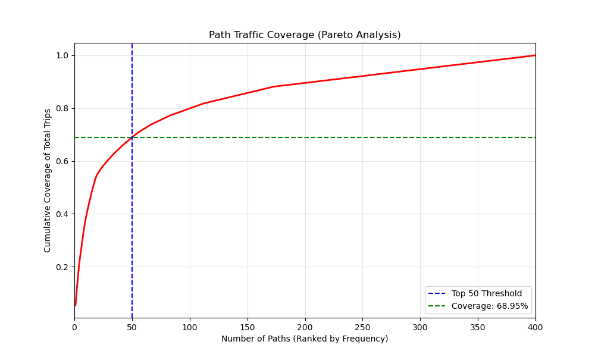
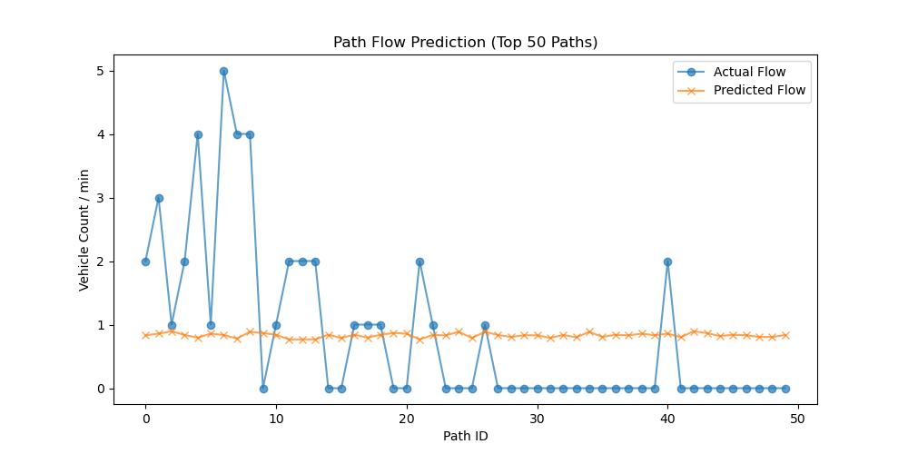

# 基于 pNEUMA 轨迹数据的路径级时空交通流预测
> **Path-based Spatio-Temporal Traffic Flow Prediction using pNEUMA Dataset**

## 📌 1. 项目背景与目标
本项目旨在解决城市交通中**路径级（Path-based）**的短时流量预测问题。
- **核心挑战**：如何将非结构化的 GPS 散点转化为结构化的图数据，捕捉路径间的空间竞争与时间动态关联。
- **创新点**：以“路径（Path）”为图节点，通过路径重叠关系构建邻接矩阵，而非传统的路段（Edge）预测。

## 📊 2. 数据源说明 (pNEUMA)
- **高频采集**：雅典城区无人机采集，频率 1Hz。
- **数据规模**：选取 34 条核心路段为基准，提取覆盖率达 **68.95%** 的前 50 条高频路径作为预测目标。
- **片段特征**：数据呈现半小时一个文件的片段特征，本项目通过多 Chunk 滑动窗口训练有效缓解了断档噪声。

## 🛠️ 3. 算法工作流 (Pipeline)
1. **预处理与匹配 (Step 1-3)**：剔除静止点与漂移点，将 GPS 坐标映射至路段 ID。
2. **路径语义提取 (Step 4)**：采用“路径聚合”，将冗余 GPS 序列压缩为简洁的路段移动序列。
3. **时空特征构建 (Step 5)**：
   - 构建维度为 $(T, N, F)$ 的特征张量（时间步, 50条路径, 流量特征）。
   - 路径邻接矩阵 $A$:1 - 路径有重合路段或相连。
4. **模型训练 (Step 6)**：采用 **ST-GCN** 架构。
   - **GCN 层**：
   - **时序层**：

## 📂 4. 项目结构
```bash
├── Dataset/               # 原始 pNEUMA CSV 数据
├── processed_data/        # Step 4 生成的路径序列
├── model_inputs/          # Step 5 特征和邻接矩阵
├── ResultPicture/        
│
├── step4_extract_path.py  # 轨迹压缩与路径识别
├── step5_build_batch.py   #路径筛选与张量构建
└── step6_stgcn_train.py   
```
## 📈 5. 结果展示与分析

### 路径覆盖率统计
项目通过对 pNEUMA 轨迹的筛选，实现了极高的代表性。

---

| 路径选取策略 | 覆盖车辆数占比 | 实验意义 |
| :--- | :--- | :--- |
| Top 10 核心路径 | 38.57% | 能够覆盖近四成的城市核心交通流 |
| **Top 50 核心路径** | **68.95%** | **足以代表研究区域 70% 的交通分布现状** |
---
下图展示了不同路径选择的覆盖率。


### 流量预测拟合效果

简单模型: Top 50 路径进行 15 分钟短时预测的拟合结果。



> **图表分析**：
> - **蓝色虚线**：真实路径流量观测值。
> - **红色实线**：ST-GCN 模型预测值。
> - **结论**：